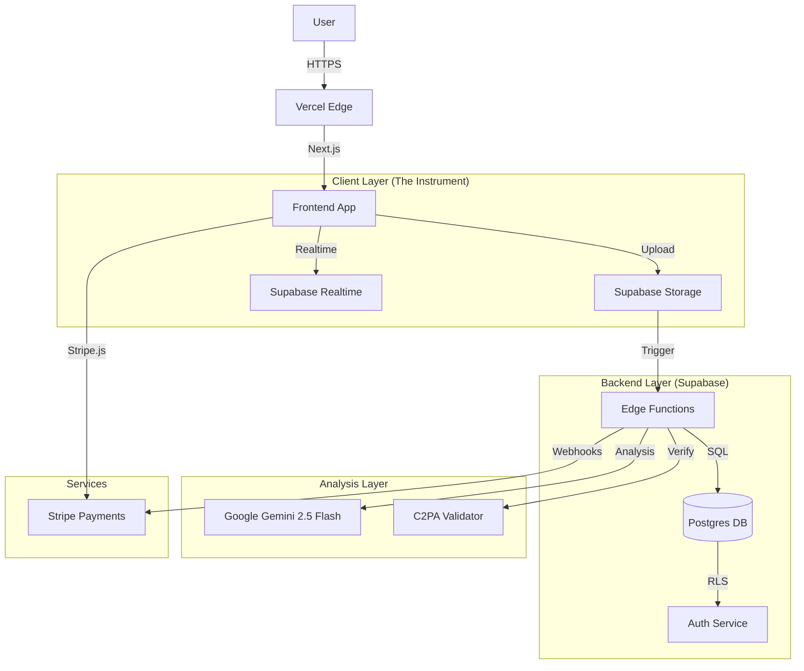

# System Architecture

## Overview
AI Risk Shield is a high-security, forensic analysis platform built on a serverless architecture. It leverages Next.js for the frontend, Supabase for the backend, and Google Gemini for multimodal AI analysis.

## Core Stack
*   **Frontend Check**: `Next.js 16` (App Router), `Tailwind CSS`, `Framer Motion` (Physics).
*   **Backend**: `Supabase` (Postgres, GoTrue Auth, Realtime, Storage).
*   **AI Engine**: `Google Gemini 2.5 Flash` (Multimodal Analysis).
*   **Provenance**: `C2PA` (Content Credentials) via `c2pa-node` / WASM.
*   **Infrastructure**: `Vercel` (Hosting, API Routes).

## Architecture Diagram

## Key Components

### 1. The Forensic Interface (Frontend)
*   **Design System**: Custom "Dieter Rams" aesthetic using Tailwind utility classes (`design/tokens`).
*   **State Management**: React Server Components (RSC) for data fetching, Client Components for interactivity.
*   **Realtime**: Using `supabase-js` channel subscriptions to stream analysis logs to the UI `RSScanner`.
*   **Product Reality**: Dashboard **Scans & Reports** is the canonical home; landing is the onboarding bridge.

### 2. Security & Multi-Tenancy (Backend)
*   **Row Level Security (RLS)**: **ALL** data access is governed by Postgres RLS policies.
    *   `auth.uid()` checks for user ownership.
    *   `get_active_tenant()` helper for hierarchical access (Agency -> Client).
*   **Storage Policies**: Files are isolated in private buckets with signed URL access only.

### 3. Analysis Pipeline (Current: Synchronous)
1.  **Ingest**: Client POSTs file to `/api/analyze`.
2.  **Process**:
    *   **Upload**: API saves file to Supabase Storage (Admin Client).
    *   **Gemini**: Analyzes buffer in-memory for IP/Safety.
    *   **C2PA**: extracts manifest and signature data.
3.  **Result**: Data written to `scans` and `scan_findings` tables.
4.  **Return**: API responds with JSON risk profile.
> **Note**: Current implementation uses standard Next.js API Routes (`app/api/*`).

### 4. Authentication (Freemium Magic Link)
*   **Supabase Auth Magic Links**: We use `generateLink` (service role) and Resend to deliver dynamic emails (risk score + report CTA).
*   **Legacy Custom Table**: A custom `magic_links` table existed previously; it is deprecated (see `20260208_cleanup_magic_links.sql`) and should not be relied on for client access.
*   **SOC 2 Compliance**: Implementation requires strict token expiry and least‑privilege RLS in any legacy paths.

## Data Model (Simplified)
*   `access_control`: `tenants` <-> `users` (Many-to-Many via `tenant_users`).
*   `core`: `assets` -> `scans` -> `scan_findings`.
*   `billing`: `subscriptions` -> `usage_ledger`.

## Critical Dependencies
*   `@supabase/supabase-js`: Core client.
*   `stripe`: Payment processing.
*   `c2pa`: Content provenance library.
*   `zod`: Runtime validation.
